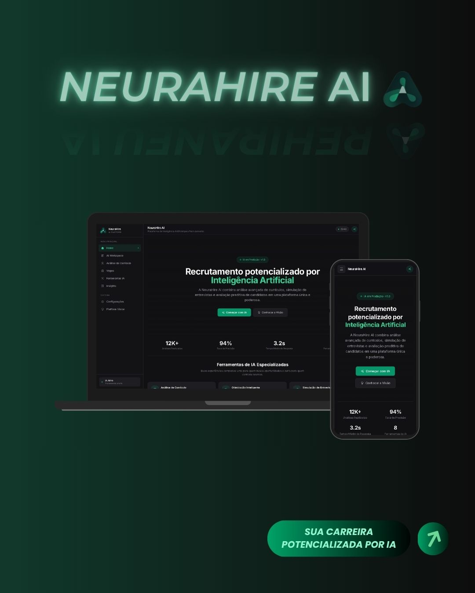

  <h1 align="center">NeuraHire AI</h1>

  <p align="center">
    Plataforma de Inteligência Artificial para recrutamento, seleção e desenvolvimento profissional.
  </p>

  <p align="center">
    O NeuraHire AI foi desenvolvido para auxiliar candidatos e recrutadores por meio de análises inteligentes, feedbacks objetivos e ferramentas voltadas ao mercado de trabalho.
  </p>

  <div align="center">


  <br>

  <a href="https://neura-hire-ai.vercel.app/" target="_blank">
    
  </a>

  </div>

  <br>

---

# 🎨 Interface


  <br>

  <p align="center">
    
  </p>

  <p align="center">
    <i>Interface moderna, responsiva e focada em experiência do usuário para recrutamento e desenvolvimento profissional.</i>
  </p>

  <br>

---

# 📖 Sobre o projeto

O **NeuraHire AI** é uma plataforma de Inteligência Artificial desenvolvida para apoiar candidatos e recrutadores durante diferentes etapas do processo seletivo.

A proposta do projeto é reunir ferramentas que auxiliam na análise de currículos, preparação para entrevistas e desenvolvimento profissional, proporcionando feedbacks claros, organizados e objetivos.

O projeto foi desenvolvido com foco em uma interface moderna, intuitiva e responsiva, buscando oferecer uma experiência agradável para diferentes dispositivos.

---

# ✨ Funcionalidades

- 📄 Análise inteligente de currículos
- ✍️ Otimização e melhoria de currículos
- 🎤 Simulação de entrevistas com feedback personalizado
- 💬 Chat com IA para orientação profissional
- ⚙️ Configurações personalizadas do comportamento da IA
- 👥 Dashboard para candidatos e recrutadores
- 🤖 8 ferramentas de IA integradas
- 🌙 Interface Dark Mode responsiva

---

# 🚀 Tecnologias

### Front-end

- HTML5
- CSS3
- JavaScript (ES6+)
- Tailwind CSS

### Back-end

- Node.js
- Express.js

### Inteligência Artificial

- Groq API

---

## 📂 Estrutura do Projeto

```text
NeuraHire-AI/
│
├── backend/
│   ├── src/
│   │   ├── controllers/
│   │   │   └── ai.controller.js
│   │   ├── routes/
│   │   │   └── ai.routes.js
│   │   ├── services/
│   │   │   └── ai.service.js
│   │   └── utils/
│   │       └── promptBuilder.js
│   │
│   ├── .env.example
│   └── server.js
│
├── frontend/
│   ├── assets/
│   │   ├── logo/
│   │   └── mockup/
│   │
│   ├── css/
│   │   ├── components.css
│   │   ├── global.css
│   │   └── input.css
│   │
│   ├── js/
│   │   ├── api/
│   │   │   └── api.js
│   │   ├── chat/
│   │   │   └── chat.js
│   │   ├── core/
│   │   │   ├── main.js
│   │   │   ├── router.js
│   │   │   └── tools.js
│   │   ├── forms/
│   │   │   └── contact.js
│   │   ├── settings/
│   │   │   └── settings.js
│   │   └── ui/
│   │       └── ui.js
│   │
│   └── index.html
│
├── package.json
│
├── package-lock.json
│
└── README.md
```

---

# ⚙️ Como executar o projeto

## Clone o repositório

```bash
git clone https://github.com/Lucas-tech-silva/NeuraHire-AI.git
```

## Acesse a pasta

```bash
cd NeuraHire-AI
```

## Instale as dependências

```bash
npm install
```

## Configure as variáveis de ambiente

Crie um arquivo `.env` na pasta do backend contendo sua chave da API utilizada pelo projeto.

Exemplo:

```env
GROQ_API_KEY=SUA_CHAVE_AQUI
```

## Execute o servidor

```bash
node backend/server.js
```

---

# 🎯 Objetivo

O NeuraHire AI foi criado como um projeto de estudo com o objetivo de aplicar conceitos de desenvolvimento Front-End, Back-End e Inteligência Artificial em um contexto real voltado para recrutamento e desenvolvimento profissional.

---

## 🚀 Roadmap

O projeto continuará evoluindo conforme novos recursos forem sendo desenvolvidos.

### ✅ Versão Atual (v1.0)

- 8 ferramentas de IA integradas
- Dashboard para candidatos e recrutadores
- Análise inteligente de currículos
- Simulação de entrevistas com feedback
- Chat com IA para orientação profissional
- Configurações personalizadas da IA
- Interface responsiva com Dark Mode

### 🔄 v1.1

- Migração para React
- Expansão das ferramentas de IA
- Histórico de conversas
- Melhorias na experiência do usuário

### 🚀 v2.0

- Sistema de autenticação
- Contas de usuários
- Histórico de atividades
- Componentização avançada
- Otimização de performance
- Refatoração para uma arquitetura mais escalável

### 🔮 Futuro

- Recomendações personalizadas com IA
- Matching inteligente de vagas
- Expansão do ecossistema NeuraLabs
- Evolução contínua da plataforma

---

# 📱 Responsividade

O projeto foi desenvolvido seguindo a abordagem **Mobile First**, oferecendo uma experiência consistente em diferentes tamanhos de tela.

---

# 👨‍💻 Autor

Desenvolvido por **Lucas Silva**.

- 🌐 Portfólio: https://lucas-portfolio-flax.vercel.app/

- 💻 GitHub: https://github.com/Lucas-tech-silva

- 🔗 LinkedIn: https://www.linkedin.com/in/lucassilva-developer/

- 📧 Email: [lucassilva1710@yahoo.com](mailto:lucassilva1710@yahoo.com?subject=Oportunidade%20-%20NeuraHire%20AI&body=Olá%20Lucas,%0A%0AVi%20o%20projeto%20NeuraHire%20AI%20e%20gostaria%20de%20conversar%20sobre%20uma%20oportunidade,%20parceria%20ou%20possível%20colaboração.)

---

  <br>

  <p align="center">
    <i>"A tecnologia não substitui talentos; ela potencializa pessoas. O NeuraHire AI nasceu para transformar a forma como profissionais encontram oportunidades." — Lucas Silva</i>
  </p>

  <br>

  <p align="center">
    <i>Desenvolvido como um projeto de estudo para aplicar Inteligência Artificial em recrutamento, seleção e desenvolvimento profissional.</i>
  </p>

---
